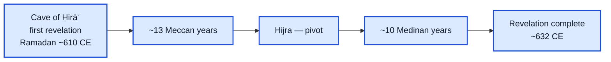

:::caution[Human review required]
Lineage and chronology claims need sign-off from a qualified Islamic-studies /
history reviewer before treating this page as settled content. Source trail:
`docs/research/lineage-history-sourcing.md` (from wayfinder [#12](https://github.com/kihonq/qurescent/issues/12)).
:::

Diagrams use Mermaid. **Solid** nodes are the agreed Muhammad ﷺ → Adnan chain
(Sahih al-Bukhari). **Dashed / muted** nodes are traditionally reported material
that classical scholars explicitly dispute — shown only as a caveat, not as names
presented as certain.

## How to read the styles

## Prophetic lineage — Muhammad ﷺ to Adnan

Recorded in Sahih al-Bukhari (before Hadith 3851). Classical consensus treats this
segment as agreed; several early authorities say one should not extend the nasab
past Adnan as if certain.

```mermaid
flowchart TB
  Adnan[Adnan]:::confirmed --> Maadd[Maʿadd]:::confirmed
  Maadd --> Nizar[Nizar]:::confirmed
  Nizar --> Mudar[Mudar]:::confirmed
  Mudar --> Ilyas[Ilyas]:::confirmed
  Ilyas --> Mudrikah[Mudrikah]:::confirmed
  Mudrikah --> Khuzaymah[Khuzaymah]:::confirmed
  Khuzaymah --> Kinanah[Kinanah]:::confirmed
  Kinanah --> Nadr[an-Naḍr]:::confirmed
  Nadr --> Malik[Malik]:::confirmed
  Malik --> Fihr[Fihr]:::confirmed
  Fihr --> Ghalib[Ghalib]:::confirmed
  Ghalib --> Luayy[Luʾayy]:::confirmed
  Luayy --> Kab[Kaʿb]:::confirmed
  Kab --> Murrah[Murrah]:::confirmed
  Murrah --> Kilab[Kilab]:::confirmed
  Kilab --> Qusay[Qusay]:::confirmed
  Qusay --> AbdManaf[ʿAbd Manaf]:::confirmed
  AbdManaf --> Hashim[Hashim]:::confirmed
  Hashim --> AbdMuttalib[ʿAbd al-Muṭṭalib]:::confirmed
  AbdMuttalib --> Abdullah[ʿAbdullah]:::confirmed
  Abdullah --> Muhammad["Muhammad ﷺ"]:::confirmed

  classDef confirmed fill:#dbeafe,stroke:#1d4ed8,stroke-width:2px,color:#0f172a
```

### Beyond Adnan (not drawn as settled)

Between Adnan and Ismaʿil / Ibrahim, reports disagree on both **names** and
**counts** (variants of 7 / 9 / 15 / 40 intervening ancestors). Ibn Hibban,
Ibn Hazm, al-Dhahabi, and others treat certainty as ending at Adnan. This site
does **not** list one traditional name chain as fact.

## Revelation chronology — settled shape

Safe to depict as settled: ~**23 years** of revelation, ~**13 Meccan** years before
the Hijra and ~**10 Medinan** years after, beginning with the first revelation in
the cave of Hira when the Prophet ﷺ was about forty.

### What this page does not settle

- Exact day of the first revelation within Ramadan (17th / 21st / 23rd / 24th are
  all attested)
- A single surah-by-surah chronological order (traditional Ibn ʿAbbas–style lists,
  the 1924 Cairo reconstruction, and academic lists diverge)

A surah-order table, if added later, must be labeled as a **named traditional
reconstruction**, not as unique historical fact.

## Sources (short)

- Sahih al-Bukhari, nasab before Hadith 3851
- Ibn Hajar, *Fatḥ al-Bārī*; al-Dhahabi, *Siyar*; Ibn Hibban; Ibn Hazm (as cited
  in the research note)
- Egypt’s Dar al-Ifta on revelation periodization

Full citations and links: [lineage-history-sourcing.md](https://github.com/kihonq/qurescent/blob/feat/astro-starlight-upgrade/docs/research/lineage-history-sourcing.md).
